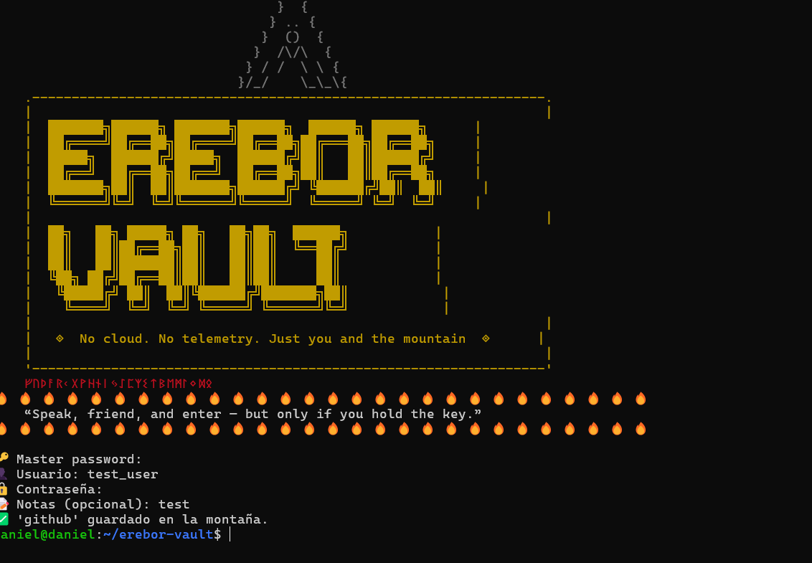
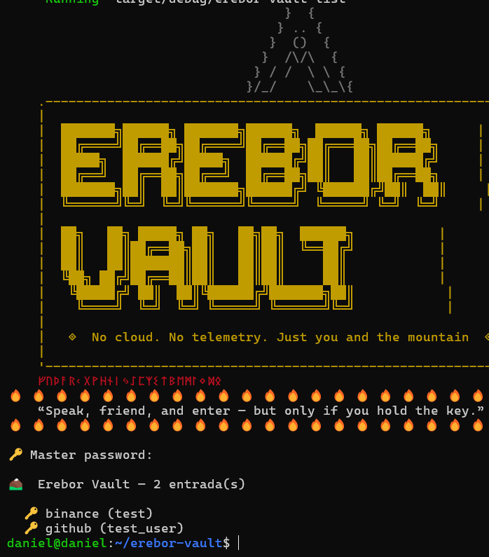
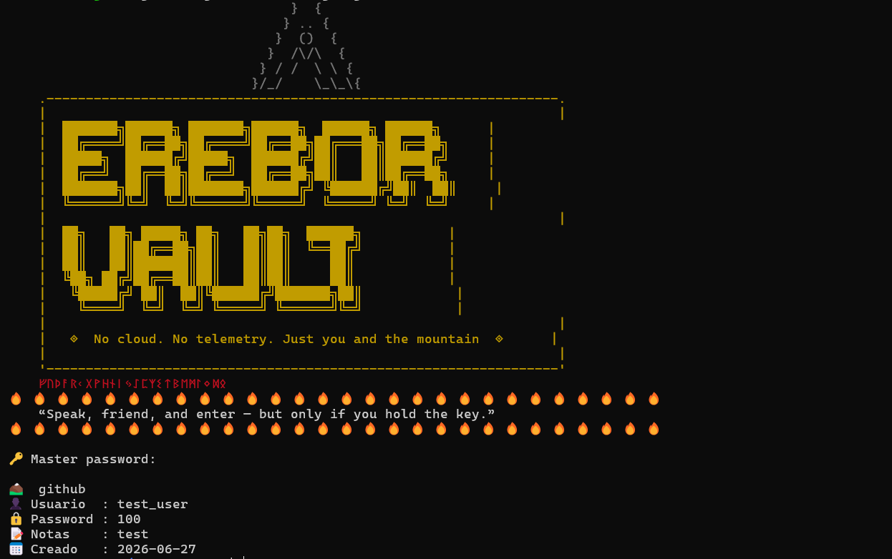

<p align="center">

</p>

<p align="center">
  
  
  
  
  
</p>

<p align="center">
  <b>No cloud. No telemetry. Just you and the mountain.</b><br/>
  Local CLI password manager secured with Argon2id + ChaCha20-Poly1305
</p>

---

<p align="center">

```
  ᚠ  ᚢ  ᚦ  ᚨ  ᚱ  ᚲ  ᚷ  ᚹ  ᚺ  ᚾ  ᛁ  ᛃ  ᛇ  ᛈ  ᛉ  ᛊ

    ⛰️  THE LONELY MOUNTAIN  ⛰️
    
  Under the mountain, your secrets rest.
  Sealed by password and keyfile — two keys, one gate.
  No cloud reaches these depths.
  
  ᚠ  ᚢ  ᚦ  ᚨ  ᚱ  ᚲ  ᚷ  ᚹ  ᚺ  ᚾ  ᛁ  ᛃ  ᛇ  ᛈ  ᛉ  ᛊ
```

</p>

---

## 🏔️ The Legend

> *"Speak, friend, and enter — but only if you hold the key."*

In Tolkien's world, **Erebor** — the Lonely Mountain — was the most impenetrable fortress in Middle-earth. Its treasures were sealed behind a door no army could break. Only those who knew the secret could enter.

**Erebor Vault** follows that same principle. Your passwords are sealed inside an encrypted vault on your machine. No account, no sync, no cloud. The only way in is through your master password and keyfile — both required, always local.

---

## 🔐 Security

```
[master password + keyfile]
         ↓
     Argon2id (KDF)          ← brute-force resistant key derivation
         ↓
  ChaCha20-Poly1305          ← authenticated encryption
         ↓
      vault.enc              ← encrypted file on disk, never leaves your machine
```

- **Argon2id** — winner of the Password Hashing Competition, resistant to GPU/ASIC attacks
- **ChaCha20-Poly1305** — authenticated encryption, detects tampering
- **Dual unlock** — master password + keyfile, both required
- **Zero network** — runs 100% offline, no telemetry, no accounts

---

## ✨ Features

```bash
✓ Master password + keyfile dual authentication
✓ AES-grade encryption (ChaCha20-Poly1305)
✓ Argon2id key derivation — brute force resistant
✓ Add, get, list, delete entries
✓ Epic ASCII banner on every launch
✓ Zero cloud — your machine, your data
✓ Open source — GPL v3, fully auditable
```

---

## 📸 Preview

<p align="center">
  
</p>

<p align="center">
  
</p>

<p align="center">
  
</p>
---

## 🚀 Installation

```bash
# Clone the repository
git clone https://github.com/DanielQuintanillaPaniagua/erebor-vault.git

# Enter the directory
cd erebor-vault

# Build the release binary
cargo build --release

# Optional: install globally
sudo cp target/release/erebor-vault /usr/local/bin/erebor
```

**Requirements:** Rust 1.70+ · Linux / WSL · `build-essential`

```bash
# Install Rust
curl --proto '=https' --tlsv1.2 -sSf https://sh.rustup.rs | sh

# Install build tools (Ubuntu/Debian)
sudo apt install build-essential -y
```

---

## 📖 Usage

### First time — initialize the vault

```bash
erebor init
```

This generates your keyfile at `~/.erebor/erebor.key` and creates the encrypted vault.

> ⚠️ **Back up your keyfile.** Losing it means losing access to your vault forever.

### Commands

```bash
erebor init            # Initialize vault (first time only)
erebor add <name>      # Add a new entry
erebor get <name>      # Retrieve an entry
erebor list            # List all stored entries
erebor delete <name>   # Delete an entry
```

### Example session

```bash
$ erebor add github
🔑 Master password: ••••••••
👤 Usuario: daniel@email.com
🔒 Contraseña: ••••••••
📝 Notas (opcional): personal account
✅ 'github' guardado en la montaña.

$ erebor list
🔑 Master password: ••••••••

⛰️  Erebor Vault — 2 entrada(s)

  🔑 github (daniel@email.com)
  🔑 binance (daniel@email.com)
```

---

## 📁 Project Structure

```
erebor-vault/
│
├── src/
│   ├── main.rs       ← CLI entry point and commands
│   ├── banner.rs     ← Epic ASCII banner
│   ├── vault.rs      ← Encryption / decryption logic
│   ├── config.rs     ← Paths and configuration
│   └── models.rs     ← Data structures (Entry, Vault)
├── Cargo.toml        ← Dependencies
└── README.md
```

---

## ⚠️ Important

```
Your vault lives at:   ~/.erebor/vault.enc
Your keyfile lives at: ~/.erebor/erebor.key

BACK UP YOUR KEYFILE.
If you lose it, your vault cannot be recovered.
Not by you. Not by anyone. That's the point.
```

---

## 🦀 Built With

- [Rust](https://www.rust-lang.org/) — systems language, memory safe
- [clap](https://crates.io/crates/clap) — CLI argument parsing
- [argon2](https://crates.io/crates/argon2) — key derivation
- [chacha20poly1305](https://crates.io/crates/chacha20poly1305) — authenticated encryption
- [serde_json](https://crates.io/crates/serde_json) — vault serialization
- [colored](https://crates.io/crates/colored) — terminal colors

---

## 👨‍💻 Author

**Daniel Quintanilla Paniagua**  
Computer Systems & Network Engineering Student — UGB, El Salvador 🇸🇻

<p align="center">
  <a href="https://github.com/DanielQuintanillaPaniagua">
    
  </a>
</p>

---

## 📄 License

GPL v3 — open source, auditable, yours.

*Inspired by cypherpunk philosophy and the dwarven vaults of Middle-earth.*

---

<p align="center">

</p>
